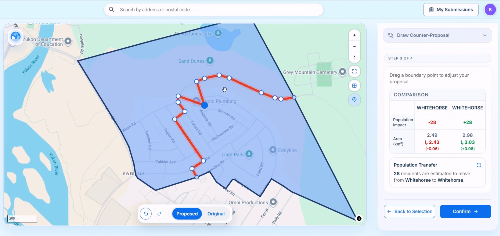

# Canadian Redistribution Map Platform (CRMP)

[](https://github.com/6Beaming/Canadian-Redistribution-Map-Platform/actions/workflows/ci.yml)
[](https://react.dev/)
[](https://vite.dev/)
[](https://nodejs.org/)
[](https://expressjs.com/)
[](https://supabase.com/)
[](https://maplibre.org/)
[](https://tailwindcss.com/)
[](https://www.docker.com/)
[](https://jestjs.io/)

## Demo

[](https://youtu.be/M4CyjWInyD4)

[▶ Watch the CRMP demo](https://youtu.be/M4CyjWInyD4)

## Background

Every ten years, the Canadian government redraws the lines for federal voting districts (ridings). Currently, if citizens want to provide feedback or object to new boundaries, they must submit emails or physical letters.

CRMP is a map-centred civic engagement platform for exploring proposed Canadian federal electoral boundaries. Public users can review local boundary and demographic information, submit feedback or objections, and draw counter-proposals. Commissioners receive a province-scoped workspace for reviewing, organizing, comparing, and archiving those submissions.

## Highlights

### Public participation

- Explore electoral districts and dissemination areas on a responsive MapLibre map.
- Search Canadian places and return to a saved postal area.
- Review demographic and population information for selected areas.
- Submit comments, formal objections, and map-based counter-proposals.
- Track previous submissions and reopen their map context.

### Commissioner workflow

- Review province-scoped submissions in map, table, and detail views.
- Filter and analyze submissions, render a heatmap, and export CSV data.
- Coordinate reviews with assignments, labels, comments, and status changes.
- Compare submitted geometry with the active map release.
- Create and review immutable archive versions through the Archived Tree.
- Receive scoped updates through an authenticated WebSocket gateway.

## Architecture

CRMP has three main parts:

- **Interactive map:** The React frontend uses MapLibre to display electoral districts, demographic information, and proposed boundary changes. Public users can select an area, submit feedback, or draw a counter-proposal directly on the map.
- **Application server:** The Express backend handles sign-in, submissions, commissioner tools, exports, archived maps, and map data. It also sends live workspace updates through WebSockets.
- **Database and authentication:** Supabase provides user authentication and a PostgreSQL database for profiles, submissions, review activity, and archived versions.

In production, Docker builds the frontend and runs it together with the server on port `3000`. More technical details are available in the [Data Architecture](docs/After-Course/data-architecture.md) and [Map Architecture](docs/Demo-3/map-architecture.md) documents.

## Technology stack

| Area | Technologies |
| --- | --- |
| Frontend | React 19, Vite 8, React Router, Tailwind CSS, Radix UI, Recharts |
| Mapping | MapLibre GL JS, PMTiles, Google Places and Map Tiles APIs |
| Backend | Node.js, Express, `ws` WebSockets |
| Data and auth | Supabase, PostgreSQL, Supabase Auth |
| Geometry | JSTS, GeoJSON, versioned local indexes |
| Testing and delivery | Jest, Docker, GitHub Actions, GitHub Container Registry |

## Getting started

### Prerequisites

- Node.js 22 is recommended; Node.js 18 or newer is required.
- npm, included with Node.js.
- A Supabase project configured with the migrations in `supabase/migrations`.
- Browser-restricted Google Maps credentials for Places API (New) and Map Tiles API.
- A separate server-restricted Google Maps key for the Geocoding API.

### 1. Install dependencies

```bash
npm ci
```

### 2. Configure the environment

Copy the example file `.env.example` to `.env` in your local repo and replace its placeholders:


| Variable | Purpose |
| --- | --- |
| `SUPABASE_URL` | Supabase project URL used by the server |
| `SUPABASE_PUBLISHABLE_KEY` | Publishable Supabase key used by the server |
| `SUPABASE_SERVICE_ROLE_KEY` | Privileged server-only key for trusted operations |
| `VITE_SUPABASE_URL` | Supabase project URL compiled into the browser bundle |
| `VITE_SUPABASE_PUBLISHABLE_KEY` | Publishable Supabase key compiled into the browser bundle |
| `VITE_GOOGLE_MAPS_API_KEY` | Browser key for Google Places and Map Tiles |
| `GOOGLE_MAPS_SERVER_API_KEY` | Server-only key for postal-code geocoding |
| `CLIENT_ORIGIN` | Allowed browser origin; defaults to `http://localhost:5173` |


### 3. Prepare the database

Apply the SQL migrations in `supabase/migrations` to the Supabase project used by your `.env`. With the Supabase CLI linked to the intended project, this can be done with:

```bash
npx supabase db push
```

Review the target project before pushing migrations. The repository contains the application schema but does not include production credentials or seeded user accounts.

### 4. Run the application

```bash
npm run dev
```

Open [http://localhost:5173](http://localhost:5173). Vite serves the frontend and proxies `/api` and WebSocket traffic to Express at [http://localhost:3000](http://localhost:3000). Check server health at [http://localhost:3000/api/health](http://localhost:3000/api/health).

To run each process separately:

```bash
npm run dev:server
npm run dev:client
```

## Docker

Docker Compose builds the frontend and runs the compiled SPA, Express API, WebSocket gateway, and checked-in map assets from one container:

```bash
docker compose up --build
```

Open [http://localhost:3000](http://localhost:3000), or check [http://localhost:3000/api/health](http://localhost:3000/api/health).

For an HTTPS deployment, set the `DOCKER_*` origin and redirect variables documented in `.env.example`, including `DOCKER_COOKIE_SECURE=true`. Because `VITE_*` values are embedded at build time, rebuild the image whenever they change.

See the [Docker Access Guide](docs/Docker-Instructions.md) for complete setup, GHCR, health-check, deployment, and troubleshooting instructions.

## Verification

```bash
npm test
npm run check:server
npm run build
```

- `npm test` runs the Jest API, data-contract, UI-contract, geometry, archive, and realtime test suites.
- `npm run check:server` syntax-checks the server entry points and core modules.
- `npm run build` creates the production frontend bundle in `dist`.
- `npm run test:coverage` runs the Jest suite with coverage reporting.

The CI workflow runs tests, server checks, and a production build on every push and pull request. Main-branch and version-tag builds can also publish container images through the repository's package workflow.

## Repository layout

```text
.
├── src/                    React application, map UI, workers, and map assets
│   └── data/map/           Metadata, PMTiles, manifests, indexes, and releases
├── server/                 Express API, WebSocket runtime, and domain services
├── supabase/migrations/    PostgreSQL schema and policy migrations
├── scripts/reusable/       Repeatable geographic data and release builders
├── scripts/one-time/       Dry-run-first migration and cutover utilities
├── tests/                  Jest integration and contract tests
├── docs/                   Architecture, workflow, and project documentation
├── Dockerfile              Production multi-stage container build
└── docker-compose.yml      Local production-style runtime
```

## Map data pipeline

The reusable data tooling converts source geography into two related outputs:

1. browser-oriented PMTiles and labels for fast overview rendering; and
2. immutable exact-geometry releases with DGUID, scope, adjacency, topology, and display indexes for validation and editing.

See [Reusable Scripts](scripts/reusable/README.md) for the build order and [Map Data](src/data/map/README.md) for the runtime directory contract. Raw external Statistics Canada inputs are intentionally excluded from Git; generated runtime assets required by the application are checked in.

## Additional documentation

- [Post-Course Data Architecture](docs/After-Course/data-architecture.md)
- [Map Architecture](docs/Demo-3/map-architecture.md)
- [Workspace Frontend](docs/Demo-3/workspace.md)
- [Workspace Backend](docs/Demo-3/workspace-backend.md)
- [Authentication Workflow](docs/Demo-1/Auth_Workflow.md)
- [Future Counter-Proposal Scaling Plan](docs/After-Course/future-update-plan.md)
