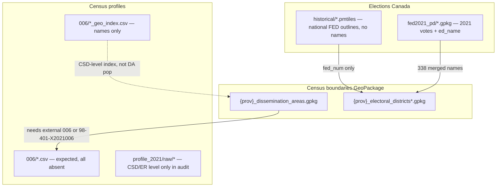

# Actual Redistricting Data Guide

This document describes the **actual** contents of `CRMP-full-data.zip`. It mirrors the structure of `CRMP-full-data/redist-mini-guide.md` but reflects **what is on disk**, including paths and formats not listed in the canonical schema documents.

For **expected** (canonical) layout, see `CRMP-full-data/README.md` and `CRMP-full-data/redist-mini-guide.md`.  
For **gaps vs expected**, see `Missing_Files.md` (this folder).

**Audit reference:** `data_schema_audit_report.txt` (generated 2026-06-19; 210 files schema-sampled).

---

## What a redistricting dataset needs

Same logical model as the canonical mini-guide:

1. **Building blocks** — small geographic units (typically dissemination areas, DAs).
2. **Assignment table** — `unit_id → district_id` (application layer; not in the zip).
3. **Population totals** — census counts joinable to building blocks on standard IDs (`DGUID`, etc.).

Population equality rules and adjacency graphs are unchanged; this guide only documents **which files in the current bundle** satisfy each role.

---

## Bundle layout (actual)

After extracting the outer zip, the effective root is:

```text
CRMP-full-data/
└── raw_data/
    ├── elections_canada/
    │   ├── fed2021_pd/                    # 13 × polling-district GeoPackages (2021 votes)
    │   ├── historical/                    # 3 × FED boundary PMTiles (2003 / 2015 / 2023 RO)
    │   ├── fed2021_source/               # Source shapefile fragments + placeholders
    │   └── polling_districts/
    │       └── elections_canada/processed/
    │           └── polling_districts_results_2006_2023.csv   # 528 MB (not in canonical schema)
    ├── statistics_canada/
    │   ├── census_boundaries/{prov}/      # GeoPackages — completeness varies by prov
    │   └── census_profiles/
    │       ├── profile_2021/              # Numbered StatCan product folders
    │       ├── statscan_*_fednum_*.csv    # Historical FED profiles
    │       └── README.md
    └── data/
        └── statistics_canada/census/      # Duplicate copies of some statscan CSVs
```

**Nested archives:** four StatCan product zips under `profile_2021/raw/` extract in-place to sibling folders (e.g. `98-401-X2021008_eng_CSV/`).

---

## The building block: dissemination areas (DAs)

### Polygons (actual paths)

Canonical path (per mini-guide):

`raw_data/statistics_canada/census_boundaries/{prov}/{prov}_dissemination_areas.gpkg`

| `{prov}` | File | Audit status | Feature count (sample) |
|----------|------|--------------|-------------------------|
| `ab`, `bc`, `mb`, `sk`, `nl`, `pe`, `yt` | `{prov}_dissemination_areas.gpkg` | Present | varies by province/territory |
| `on`, `qc`, `ns`, `nb`, `nt`, `nu` | `{prov}_dissemination_areas.gpkg` | **Absent** | — |

**Note on New Brunswick:** `{prov}_aggregate_dissemination_areas.gpkg` is present (130 features) but standard `{prov}_dissemination_areas.gpkg` is absent.

**Sample schema** (present files, layer `{prov}_dissemination_areas`):

| Column (audit) | Role |
|----------------|------|
| Geometry | Polygon / MultiPolygon (WGS 84, EPSG:4326 per schema) |
| `DGUID` | Primary join key to census profiles |
| `DAUID`, `LANDAREA`, `PRUID` | Present on sampled Yukon layer |
| `GEO_NAME` | **Not** on boundary GeoPackages — names come from profile tables only |

### Census numbers (actual paths)

**Canonical expectation** (mini-guide):

`raw_data/statistics_canada/census_profiles/profile_2021/006_dissemination_areas/`  
→ six regional profile CSVs: `atlantic.csv`, `quebec.csv`, `ontario.csv`, `prairies.csv`, `bc.csv`, `territories.csv`

**Actual bundle at that path:**

| File | Type | Columns | Usable for DA population join? |
|------|------|---------|--------------------------------|
| `quebec_geo_index.csv` | Geo index | `Geo Code`, `Geo Name`, `Line Number` | **No** |
| `territories_geo_index.csv` | Geo index | same (344 rows) | **No** — CSD-level names, not per-DA profiles |

**All six canonical regional profile CSVs are absent** (`atlantic.csv` … `territories.csv`). The two `*_geo_index.csv` files are **indexes** (name + line pointer), not long-format profile tables with `CHARACTERISTIC_ID` / `C1_COUNT_TOTAL`.

### Raw StatCan product folders (`profile_2021/raw/`)

Four nested products are extracted under `profile_2021/raw/`:

```text
98-401-X2021008_eng_CSV/
98-401-X2021018_eng_CSV/
98-401-X2021026_eng_CSV/
98-401-X2021028_eng_CSV/
```

Each contains `*_English_CSV_data.csv` (long format with `DGUID`, `GEO_LEVEL`, `GEO_NAME`, `CHARACTERISTIC_ID`, `C1_COUNT_TOTAL`).

**Critical audit finding (population rows with `CHARACTERISTIC_ID == 1`):**

| Product folder | Pop rows | `GEO_LEVEL` distribution | DA-level? |
|----------------|----------|--------------------------|-----------|
| `98-401-X2021008` | 90 | Economic region 76, Province 10, Territory 3, Country 1 | **No** |
| `98-401-X2021018` | 95 | Census subdivision 95 | **No** |
| `98-401-X2021026` | 35 | Census subdivision 35 | **No** |
| `98-401-X2021028` | 31 | Census subdivision 31 (Nunavut) | **No** |

**None of the four in-bundle raw profile CSVs contain dissemination-area rows.** They cannot substitute for the missing `006_dissemination_areas/*.csv` files (including `territories.csv` for Yukon’s 74 DAs).

The canonical DA profile product for territories is StatCan table **98-401-X2021006** (`territories.csv` in the mini-guide) — that product folder / regional CSV is **not** present in the audited bundle.

### Regional DA readiness (boundary vs profile)

| Score | Meaning | Provinces / territories (`{prov}`) |
|-------|---------|-------------------------------------|
| 0 | No DA boundary GPKG | `on`, `qc`, `ns`, `nt`, `nu` |
| 2 | DA boundary present; **no** DA profile CSV in bundle | `ab`, `bc`, `mb`, `sk`, `nl`, `pe`, `yt` |

For every province with a DA GPKG, `profile_rows` at DA level = **0** in the audited bundle.

**Join recipe (when canonical `006` CSVs exist):**

1. Load `{prov}_dissemination_areas.gpkg`.
2. Read the matching regional `006/*.csv`; filter `CHARACTERISTIC_ID == 1`.
3. Keep `DGUID`, `C1_COUNT_TOTAL`, and optionally `GEO_NAME`.
4. Merge on `DGUID`.

Until those CSVs are supplied, DA `GEO_NAME` and population must come from **external** StatCan downloads or APIs (see product 98-401-X2021006 for territories).

---

## Federal electoral district (FED) boundaries

### PMTiles (actual — matches schema)

Path: `raw_data/elections_canada/historical/`

| File | Layer | Attributes (PMTiles metadata, audit) |
|------|-------|--------------------------------------|
| `fed_boundaries_2003.pmtiles` | `fed2003_districts` | `rep_order`, `year` only |
| `fed_boundaries_2015.pmtiles` | `fed2015_districts` | `fed_num`, `prov_code`, `rep_order`, `year` |
| `fed_boundaries_2023.pmtiles` | `fed2023_districts` | `fed_num`, `rep_order`, `year` |

**PMTiles carry no riding name field** — labels require a separate name table.

### GeoPackage FED layers (actual)

Per province under `census_boundaries/{prov}/`:

- `{prov}_electoral_districts.gpkg` — current RO where present
- `{prov}_electoral_districts_2003ro.gpkg`
- `{prov}_electoral_districts_2013ro.gpkg`

Completeness varies; Ontario’s electoral-district stack is largely absent. See `Missing_Files.md`.

### FED display names (audit)

| Source | Audit result |
|--------|--------------|
| PMTiles `fed_boundaries_2023` | No `name` / `FEDNAME` attribute |
| Merged `{prov}_electoral_districts*.gpkg` + `fed2021_pd` (`ed_name`) | **338** unique `fed_num` → name pairs |
| Expected 2023 RO district count | 343 (5 short — likely 2023 RO splits not in all GPKG layers) |
| `029_feds_2023ro/` census profiles | **Folder absent** |

`fed2021_pd` supplies distinct `ed_name` per province (e.g. ON 121, QC 78, BC 42). These names reflect the **2021 election** geography and may differ from 2023 RO boundaries in PMTiles.

### FED census profiles (actual)

| Path | Status |
|------|--------|
| `profile_2021/029_feds_2023ro/` | **Absent** |
| `census_profiles/statscan_2003_fednum_profiles_census_2006.csv` | Present |
| `census_profiles/statscan_2003_fednum_profiles_census_2011.csv` | Present |
| `census_profiles/statscan_2013_fednum_profiles_census_2011.csv` | Present |
| `census_profiles/statscan_2013_fednum_profiles_census_2011_nhs.csv` | Present |

Historical FED CSVs use multi-line StatCan headers; treat as FED-level profiles, not DA building blocks.

---

## Geography name indexes (not profile tables)

Several `profile_2021/` folders contain **geo_index** CSVs only (`Geo Code`, `Geo Name`, `Line Number`):

| Location | Files (sample) | Row counts (audit) |
|----------|----------------|--------------------|
| `006_dissemination_areas/` | `quebec_geo_index.csv`, `territories_geo_index.csv` | large / 344 |
| `016_028_province_csds/` | `ab`, `nb`, `nl`, `ns`, `on`, `sk` `*_geo_index.csv` | 96–952 per file |
| `002_cmas_cas/`, `007_census_tracts/`, `009_population_centres/`, `011_designated_places/` | `data_geo_index.csv` each | varies |

These support lookup and labeling at **indexed geography levels** (often CSD or higher). They do **not** provide per-DA `C1_COUNT_TOTAL` and are not substitutes for `006` regional profile CSVs.

---

## Other `profile_2021/` folders (actual)

| Folder | Contents | Role |
|--------|----------|------|
| `002_cmas_cas/` | `data_geo_index.csv` | CMA/CA name index |
| `007_census_tracts/` | `data_geo_index.csv` | Census tract index |
| `009_population_centres/` | `data_geo_index.csv` | Population centre index |
| `011_designated_places/` | `data_geo_index.csv` | Designated place index |
| `013_fsas/` | `meta.txt` | Metadata only |
| `014_dissolved_csds/` | `meta.txt` | Metadata only |
| `012_adas/` | — | **Absent** (ADA profile CSVs not in bundle) |

---

## Optional: election results (actual)

### 2021 poll-by-poll (schema-documented)

`raw_data/elections_canada/fed2021_pd/fed2021_{prov}_polling_districts.gpkg`

Sample columns (audit): `pd_id`, `FED_NUM`, `PD_NUM`, `province`, `ed_name`, `electors_est`, party vote columns, `total_votes`, `election`, `path`.

CRS: Statistics Canada Lambert (EPSG:3347) — reproject before merging with census boundaries (EPSG:4326).

### Historical poll results (not in canonical schema)

`raw_data/elections_canada/polling_districts/elections_canada/processed/polling_districts_results_2006_2023.csv` — ~528 MB.

---

## Aggregate DAs (ADAs)

Canonical alternative (mini-guide):

- Polygons: `{prov}_aggregate_dissemination_areas.gpkg`
- Profiles: `profile_2021/012_adas/` regional CSVs

**Actual:** ADA GeoPackages exist for several provinces where boundary stacks are present. **`012_adas/` profile CSVs not present** in the audited bundle.

---

## Supporting data: adjacency

Not shipped as files. Build offline from `{prov}_dissemination_areas.gpkg` touching polygons (same as canonical mini-guide).

---

## Quick reference: where to find what



| Need | Use (actual bundle) | Gap |
|------|---------------------|-----|
| DA polygons | `{prov}_dissemination_areas.gpkg` where present | 6 provinces/territories missing |
| DA population + `GEO_NAME` | `006_dissemination_areas/{regional}.csv` | **All 6 canonical files missing** |
| Yukon DA profiles | `territories.csv` (product 98-401-X2021006) | **Missing**; raw zip products are not DA-level |
| Place names (CSD index) | `territories_geo_index.csv`, `016_028/*_geo_index.csv` | Index only — not DA attributes |
| National FED map (web tiles) | `historical/fed_boundaries_2023.pmtiles` | No embedded names |
| FED names (approx.) | Electoral GPKG + `fed2021_pd` merge | 338/343; not 2023 RO census product |
| FED census profiles (2023 RO) | `029_feds_2023ro/` | **Folder absent** |
| 2021 vote by polling district | `fed2021_{prov}_polling_districts.gpkg` | Present (all provinces) |

---

## Audit metadata

| Item | Value |
|------|-------|
| Archive file count (unextracted inventory) | 212 |
| Schema-sampled files (post-extract audit) | 210 |
| Nested zips extracted | 4 (`98-401-X2021008`, `1018`, `1026`, `1028`) |
| Audit tool | `scripts/audit_data_schema.py` + `scripts/audit_data_schema.ipynb` |

Regenerate the audit after any bundle update.
