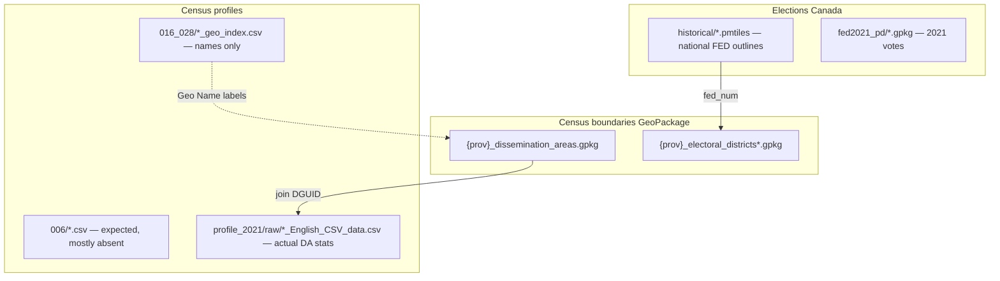

# Actual Redistricting Data Guide

This document describes the **actual** contents of `CRMP-full-data.zip`. It mirrors the structure of `CRMP-full-data/redist-mini-guide.md` but reflects **what is on disk**, including paths and formats not listed in the canonical schema documents.

For **expected** (canonical) layout, see `CRMP-full-data/README.md` and `CRMP-full-data/redist-mini-guide.md`.  
For **gaps vs expected**, see `Missing_Files.md` (this folder).

---

## What a redistricting dataset needs

Same logical model as the canonical mini-guide:

1. **Building blocks** — small geographic units (typically dissemination areas, DAs).
2. **Assignment table** — `unit_id → district_id` (application layer; not in the zip).
3. **Population totals** — census counts joinable to building blocks on standard IDs (`DGUID`, etc.).

Population equality rules and adjacency graphs are unchanged; this guide only documents **which files in the current bundle** satisfy each role.

---

## Bundle layout (actual)

After extracting the outer zip, the effective root is:

```text
CRMP-full-data/
└── raw_data/
    ├── elections_canada/
    │   ├── fed2021_pd/                    # 13 × polling-district GeoPackages (2021 votes)
    │   ├── historical/                    # 3 × FED boundary PMTiles (2003 / 2015 / 2023 RO)
    │   ├── fed2021_source/               # Source shapefile fragments + placeholders
    │   └── polling_districts/
    │       └── elections_canada/processed/
    │           └── polling_districts_results_2006_2023.csv   # 528 MB (not in canonical schema)
    ├── statistics_canada/
    │   ├── census_boundaries/{prov}/      # GeoPackages — completeness varies by prov
    │   └── census_profiles/
    │       ├── profile_2021/              # Numbered StatCan product folders
    │       ├── statscan_*_fednum_*.csv    # Historical FED profiles
    │       └── README.md
    └── data/
        └── statistics_canada/census/      # Duplicate copies of some statscan CSVs
```

**Nested archives:** four StatCan product zips under `profile_2021/raw/` extract in-place to sibling folders (e.g. `98-401-X2021008_eng_CSV/`).

---

## The building block: dissemination areas (DAs)

### Polygons (actual paths)

Canonical path (per mini-guide):

`raw_data/statistics_canada/census_boundaries/{prov}/{prov}_dissemination_areas.gpkg`

| `{prov}` | File | Audit status | Feature count (sample) |
|----------|------|--------------|-------------------------|
| `ab`, `bc`, `mb`, `sk`, `nl`, `pe`, `yt` | `{prov}_dissemination_areas.gpkg` | Present | varies by province/territory |
| `on`, `qc`, `ns`, `nb`, `nt`, `nu` | `{prov}_dissemination_areas.gpkg` | **Absent** | — |

**Sample schema** (present files, layer `{prov}_dissemination_areas`):

| Column (audit) | Role |
|----------------|------|
| Geometry | Polygon / MultiPolygon (WGS 84, EPSG:4326 per schema) |
| `DGUID` | Primary join key to census profiles |
| Other ID / area fields | Province/territory-specific naming in layer table (see audit per file) |

Some provinces/territories also ship finer-than-DA boundary layers (e.g. `{prov}_dissemination_blocks.gpkg`) that are **not** part of the mini-guide DA recipe — optional reference only where present.

### Census numbers (actual paths)

**Canonical expectation** (mini-guide):

`raw_data/statistics_canada/census_profiles/profile_2021/006_dissemination_areas/`  
→ six files: `atlantic.csv`, `quebec.csv`, `ontario.csv`, `prairies.csv`, `bc.csv`, `territories.csv`

**Actual bundle at that path:**

| File | Type | Columns | Usable for population join? |
|------|------|---------|------------------------------|
| `quebec_geo_index.csv` | Geo index | `Geo Code`, `Geo Name`, `Line Number` | **No** |
| `territories_geo_index.csv` | Geo index | same | **No** |

**Actual DA profile data (long format)** lives under extracted StatCan zips:

```text
raw_data/statistics_canada/census_profiles/profile_2021/raw/
├── 98-401-X2021008_eng_CSV.zip  →  98-401-X2021008_eng_CSV/
├── 98-401-X2021018_eng_CSV.zip  →  98-401-X2021018_eng_CSV/
├── 98-401-X2021026_eng_CSV.zip  →  98-401-X2021026_eng_CSV/
└── 98-401-X2021028_eng_CSV.zip  →  98-401-X2021028_eng_CSV/
```

Each extracted folder contains:

| File pattern | Purpose |
|--------------|---------|
| `*_English_CSV_data.csv` | **Profile table** — long format, joinable on `DGUID` |
| `*_Geo_starting_row.CSV` | Geo index for that product |
| `*_English_meta.txt`, `README_meta.txt` | StatCan metadata |

**Profile CSV schema** (all four `*_English_CSV_data.csv` files, audit sample):

| Column | Meaning |
|--------|---------|
| `CENSUS_YEAR` | Census year |
| `DGUID` | Join key — matches DA GeoPackage |
| `ALT_GEO_CODE` | Alternate geography code |
| `GEO_LEVEL` | Geography level label |
| `GEO_NAME` | Human-readable place name |
| `CHARACTERISTIC_ID` | Statistic ID (`1` = Population, 2021) |
| `CHARACTERISTIC_NAME` | Statistic label |
| `C1_COUNT_TOTAL` | Count value |
| `SYMBOL`, rate columns | Quality / derived fields |

**Join recipe (same logic as mini-guide, different file path):**

1. Load `{prov}_dissemination_areas.gpkg`.
2. Read relevant `*_English_CSV_data.csv`(s); filter `CHARACTERISTIC_ID == 1`.
3. Keep `DGUID`, `C1_COUNT_TOTAL` (and optionally `GEO_NAME`).
4. Merge on `DGUID`.

**Product split (approximate geo counts from geo-starting-row files):**

| StatCan product folder | `*_Geo_starting_row` rows | Size of `*_English_CSV_data.csv` |
|------------------------|---------------------------|-------------------------------------|
| `98-401-X2021008_eng_CSV` | 91 | ~35 MB |
| `98-401-X2021018_eng_CSV` | 96 | ~44 MB |
| `98-401-X2021026_eng_CSV` | 36 | ~15 MB |
| `98-401-X2021028_eng_CSV` | 32 | ~14 MB |

Map each product to provinces/regions using `GEO_LEVEL` / `DGUID` filters in metadata — do not assume one file equals one mini-guide regional CSV.

---

## Federal electoral district (FED) boundaries

### PMTiles (actual — matches schema)

Path: `raw_data/elections_canada/historical/`

| File | Layer | Attributes (PMTiles metadata, audit) |
|------|-------|--------------------------------------|
| `fed_boundaries_2003.pmtiles` | `fed2003_districts` | `rep_order`, `year` only |
| `fed_boundaries_2015.pmtiles` | `fed2015_districts` | `fed_num`, `prov_code`, `rep_order`, `year` |
| `fed_boundaries_2023.pmtiles` | `fed2023_districts` | `fed_num`, `rep_order`, `year` |

### GeoPackage FED layers (actual)

Per province under `census_boundaries/{prov}/`:

- `{prov}_electoral_districts.gpkg` — current RO where present
- `{prov}_electoral_districts_2003ro.gpkg`
- `{prov}_electoral_districts_2013ro.gpkg`

Completeness varies; see `Missing_Files.md` for absent provinces.

### FED census profiles (actual)

| Path | Status |
|------|--------|
| `profile_2021/029_feds_2023ro/` | **Absent** |
| `census_profiles/statscan_2003_fednum_profiles_census_2006.csv` | Present |
| `census_profiles/statscan_2003_fednum_profiles_census_2011.csv` | Present |
| `census_profiles/statscan_2013_fednum_profiles_census_2011.csv` | Present |
| `census_profiles/statscan_2013_fednum_profiles_census_2011_nhs.csv` | Present |

Historical FED CSVs use multi-line StatCan headers; treat as FED-level profiles, not DA building blocks.

---

## Geography name indexes (`016_028_province_csds/`)

Not described in the canonical mini-guide. Present in the actual bundle:

```text
profile_2021/016_028_province_csds/
├── ab_geo_index.csv
├── nb_geo_index.csv
├── nl_geo_index.csv
├── ns_geo_index.csv
├── on_geo_index.csv
└── sk_geo_index.csv
```

| Column | Meaning |
|--------|---------|
| `Geo Code` | Geography code |
| `Geo Name` | **Human-readable name** (census subdivision / related unit) |
| `Line Number` | Row pointer into profile products |

These are **indexes**, not profile tables. Useful for labeling and lookup when joined to other geography codes; they do not replace `006` profile CSVs or `*_English_CSV_data.csv`.

---

## Other `profile_2021/` folders (actual)

| Folder | Contents | Role |
|--------|----------|------|
| `002_cmas_cas/` | `data_geo_index.csv` | CMA/CA name index |
| `007_census_tracts/` | `data_geo_index.csv` | Census tract index |
| `009_population_centres/` | `data_geo_index.csv` | Population centre index |
| `011_designated_places/` | `data_geo_index.csv` | Designated place index |
| `013_fsas/` | `meta.txt` | Metadata only |
| `014_dissolved_csds/` | `meta.txt` | Metadata only |

---

## Optional: election results (actual)

### 2021 poll-by-poll (schema-documented)

`raw_data/elections_canada/fed2021_pd/fed2021_{prov}_polling_districts.gpkg`

Sample columns (audit): `pd_id`, `FED_NUM`, `PD_NUM`, `province`, `ed_name`, `electors_est`, `LPC`, `CPC`, `NDP`, `BQ`, `GPC`, `PPC`, `total_votes`, `election`, `path`.

CRS: Statistics Canada Lambert (EPSG:3347) — reproject before merging with census boundaries (EPSG:4326).

### Historical poll results (not in canonical schema)

`raw_data/elections_canada/polling_districts/elections_canada/processed/polling_districts_results_2006_2023.csv`

~528 MB; poll-station-level results 2006–2023. Columns include bilingual district names, candidate names, party labels, vote counts.

---

## Aggregate DAs (ADAs)

Canonical alternative (mini-guide):

- Polygons: `{prov}_aggregate_dissemination_areas.gpkg`
- Profiles: `profile_2021/012_adas/` regional CSVs

**Actual:** ADA GeoPackages exist for several provinces and territories where boundary stacks are present (same `{prov}` set as DA layers above, plus others as listed in the audit). **`012_adas/` profile CSVs not present** in the audited bundle.

---

## Supporting data: adjacency

Not shipped as files. Build offline from `{prov}_dissemination_areas.gpkg` touching polygons (same as canonical mini-guide).

---

## Quick reference: where to find what



| Need | Use (actual bundle) |
|------|---------------------|
| DA polygons | `{prov}_dissemination_areas.gpkg` where present |
| DA population | `profile_2021/raw/*_English_CSV_data.csv`, filter `CHARACTERISTIC_ID == 1` |
| Place names (CSD-level index) | `016_028_province_csds/*_geo_index.csv` or `GEO_NAME` in profile CSV |
| National FED map (web tiles) | `historical/fed_boundaries_2023.pmtiles` |
| FED polygons per province | `{prov}_electoral_districts*.gpkg` |
| 2021 vote by polling district | `fed2021_{prov}_polling_districts.gpkg` |

---

## Audit metadata

| Item | Value |
|------|-------|
| Archive file count (unextracted inventory) | 212 |
| Schema-sampled files (post-extract audit) | 210 |
| Nested zips extracted | 4 (`98-401-X2021008`, `1018`, `1026`, `1028`) |
| Audit tool | `scripts/audit_data_schema.py` + `scripts/audit_data_schema.ipynb` |

Regenerate the audit after any bundle update.
