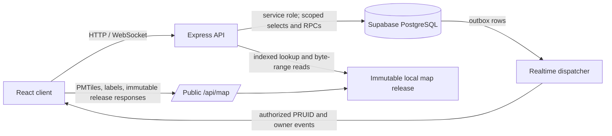

# Post-Course Data Architecture

## 1. Scope and status

This document describes the implemented data architecture after migration
`20260903060000_drop_final_legacy_objects.sql`. It is the current contract for
Supabase persistence, server-side data access, and the indexed map-data bundle
under `src/data/map/`.

The architecture deliberately separates mutable application state from
immutable geographic authority:

- Supabase stores users, submissions, collaboration state, sparse geometry
  operations, archive history, and realtime delivery state.
- The repository and Docker image store immutable Statistics Canada geometry,
  profiles, adjacency, stable vertex identities, and rendering artifacts.
- Express is the trust and composition boundary. It uses the Supabase
  service-role client, validates authorization and scope, and joins database
  rows to local map indexes.
- Browser clients do not query application tables directly. The only browser
  table grants are the authenticated user's limited `profiles` operations.

The future canonical operational mesh is not implemented by this contract. Its
design is tracked separately in [future-update-plan.md](future-update-plan.md).

## 2. Authority boundaries



The database never substitutes for the local geometry release. Conversely,
local files never contain mutable submission, Workspace, or archive state.

| Data | Authority | Notes |
| --- | --- | --- |
| User and role identity | Supabase Auth plus `profiles` | Express resolves the authenticated profile before domain access. |
| Submission text, status, ownership, and scope | Supabase | `submissions` is the aggregate root; `submission_scope_pruids` is the immutable eligibility scope. |
| DA profile, FED/PRUID membership, and adjacency | Local indexes | These legacy lookup tables were removed from Supabase. |
| Immutable base geometry and stable vertex IDs | Local release | Identified by `release_id`, `geometry_revision`, and content hashes. |
| Objection/Counter-Proposal geometry history | Supabase sparse revisions plus local release | Materialized only when a detail, review, archive, or export workflow needs geometry. |
| Archived current geometry | `archive_map_da_heads` plus local release | A base head stores no duplicate geometry; a modified head stores its materialized result. |
| General map display | PMTiles and lightweight labels | Independent from editable submission geometry. |

## 3. Supabase persistence protocol

### 3.1 Security model

All retained domain tables have Row Level Security enabled. `anon` and
`authenticated` have no direct grants on domain tables. `profiles` alone grants
authenticated users `SELECT`, `INSERT`, and `UPDATE`, constrained by its RLS
policies to the current identity.

Privileged RPCs use `SECURITY DEFINER`, set an explicit `search_path`, revoke
execution from `public`, `anon`, and `authenticated`, and grant execution to
`service_role`. The browser must call Express rather than a Supabase table or
RPC directly. This keeps authentication, Commissioner PRUID scope, optimistic
version checks, and response projection in one server boundary.

### 3.2 Identity and submission aggregate

| Table | Persistent contract |
| --- | --- |
| `profiles` | Auth UUID, email, name, role, province, optional postal/phone data, and validated postal coordinates. |
| `pending_invites` | Commissioner invitation email, inviter, and creation time. |
| `submissions` | UUID, owner, type, target DGUID(s), FED hint, title/comment, raw workflow status, timestamps, optimistic `resource_version`, active claim fields, and immutable `release_id`. |
| `submission_scope_pruids` | One or two PRUIDs for the submission. The `(submission_id, pruid)` key and database trigger enforce uniqueness and the two-province maximum. |

The database submission types are:

```text
feedback | objection | counter_proposal
```

The UI may call `feedback` a Comment and may serialize `counter_proposal` as
`counter-proposal` at HTTP boundaries. Persistence retains the underscore form.

The raw status state is:

```text
pending | accepted | rejected | archive-request | archived
```

Public My Submissions maps this raw state to the two-state Pending/Received
presentation. Commissioner projections may hide `archive-request` as
`accepted` from Commissioners who are not the requester or an assignee. The
database value remains the shared workflow truth.

`submissions.geometry` remains a nullable compatibility column, not the
Counter-Proposal authority. New Counter-Proposals set it to `NULL`; list routes
must never select it.

### 3.3 Lightweight read projections

The two list RPCs are:

- `list_my_submission_rows_v2`
- `list_commissioner_submission_rows_v2`

Both accept normalized `query`, `createdFrom`, `createdTo`, `type`, `status`,
`sort`, `pageSize`, and cursor inputs. Filtering occurs in PostgreSQL before
keyset pagination, and `pageSize` is clamped to 1--100. Their result envelope is:

```json
{
  "items": [],
  "page": {
    "pageSize": 25,
    "nextCursor": null,
    "hasMore": false
  }
}
```

Rows contain identifiers, type, DGUIDs, title, visible/raw status, version,
timestamps, scope, and small author/archive-request projections as applicable.
They exclude submission geometry, geometry revisions, geometry operations,
Workspace comments, and labels.

The SQL projection intentionally leaves DA community/population fields empty.
`server/lib/submissions/submissionListRepository.js` enriches returned rows from
the local profile index. The Dashboard's selected-DGUID endpoint is separate:
it filters DGUID, active status, and Commissioner scope in PostgreSQL, returns
`id/type/title/comment/author/status`, batches author lookup, and excludes
geometry.

### 3.4 Workspace collaboration and Archive Requests

| Table | Persistent contract |
| --- | --- |
| `workspace_comments` | Submission-local Commissioner comment, author, optional action, closing flag, and timestamp. Empty content is rejected. |
| `workspace_labels` | Submission-local fixed or custom label, color, selection state, updater, and timestamp. Fixed labels use a stable `label_key`; custom labels have no key. |
| `workspace_archive_requests` | Submission, requester, operating PRUID, sealed source revision, state, assignees, optimistic resource version, and timestamps. |
| `workspace_archive_request_votes` | One accepted/rejected vote per `(request_id, voter_id)`. |
| `archive_source_revisions` | Immutable source identity and projection sealed when an Archive Request begins; geometry submissions point to `source_geometry_revision_id`. |

Fixed label definitions are application-defined. Custom labels and all
selection state are local to one submission. There is no global label catalog.

Archive Request states are `open`, `approved`, `rejected`, `cancelled`, and
`consumed`. The requester is kept in the assignee projection by the API. Scope,
assignee visibility, allowed actions, expected-version conflicts, source
sealing, and state transitions are server-owned rules rather than browser
authority.

The nullable legacy-shaped geometry fields on `archive_source_revisions` are
not the current geometry authority. New Objection and Counter-Proposal sources
must reference a ready `submission_geometry_revisions` row.

### 3.5 Immutable release registry and sparse submission geometry

`map_data_releases` registers local release identity in Supabase. Important
fields are:

```text
release_id
geometry_revision
manifest_sha256
topology_revision
normalization_version
vertex_schema_version
lod_schema_version
state = draft | active | retired
```

Only one row may be `active`. A `release_id` is immutable: activation refuses
an existing ID whose hashes or schema versions differ.

`submission_geometry_revisions` stores one versioned descriptor for an
Objection or Counter-Proposal:

```text
submission_id + revision_number
release_id + base_revision
canonical primary_dguid + secondary_dguid
geometry_digest
validation_report
migration_state
created_by + created_at
```

The DGUID pair is sorted and distinct. `(release_id, base_revision)` references
the registered local authority. Migration state is `pending`, `ready`,
`manual_review`, or `failed`; an error is required only for the latter two.

`submission_geometry_operations` stores deterministic, sparse absolute
operations:

```json
{
  "operation_index": 0,
  "vertex_id": "v1_...",
  "operation_type": "set_vertex",
  "base_lng": -123.0,
  "base_lat": 49.0,
  "to_lng": -123.0001,
  "to_lat": 49.0001
}
```

One vertex may occur only once in a revision. Coordinates are normalized to
eight decimal places by the server. The server verifies that every vertex
exists in the selected release, belongs to the canonical shared boundary, and
is not locked before it materializes and validates the final geometry.

An Objection uses the same immutable pair descriptor with zero operations. A
Counter-Proposal requires one or more operations and is created atomically by
`create_counter_proposal_submission_v2`, which inserts the submission,
revision, operations, and scope in one transaction.

### 3.6 Archived Tree and materialized Archived Map

The archive protocol has two related histories:

- a branch version records what was merged, migrated, or reverted for one
  Comment DA or one Objection/Counter-Proposal DA pair;
- a map revision records a change to the global current archived geometry.

| Table | Persistent contract |
| --- | --- |
| `archive_branches` | Stable branch key, type, release, canonical DGUID(s), PRUID scope, current head, and optimistic resource version. |
| `archive_versions` | Immutable branch version, global merge order, source IDs, frozen submission projection, closing comment, validation, merger, and merge time. |
| `archive_version_operations` | Per-version vertex transitions and optional link to the source submission operation. |
| `archive_vertex_state` | Current per-branch vertex coordinate with the last merge sequence/version; this is the fine-grained LWW state. |
| `archive_map_revisions` | Global monotonic sequence and `genesis/merge/revert/delete` transition audit, including affected DGUIDs and before/after digests. |
| `archive_map_da_heads` | Current materialized head for each DA in a release, its digest/version, and the transition that produced it. |

Comment and Objection archive versions do not persist geometry. Their geometry
is materialized from the immutable local release during map view and export.
Counter-Proposal versions persist `branch_vertex_snapshot`, `result_geometry`,
`display_geometry`, and `geometry_digest`; a database trigger enforces this
shape distinction.

For `archive_map_da_heads`, `uses_base=true` requires both geometry columns to
be `NULL`. The server then reads the base DA from the local release. A modified
head uses `uses_base=false` and stores both exact and display materializations.
Merge, revert, and branch reinitialization are atomic service-role RPCs and use
expected branch/map versions to return conflicts instead of overwriting a
newer state.

### 3.7 Transactional realtime delivery

`realtime_outbox` is the committed event log for create/update/delete domain
mutations. Each row records aggregate identity, actor/owner, PRUID scope,
operating PRUID, resource version, projection hints, and commit time.

`realtime_scope_deliveries` fans one outbox event into monotonic per-PRUID
sequences and tracks dispatch. The WebSocket layer reads these rows and sends
only owner- or scope-authorized invalidation/projection messages. Clients
refetch authoritative HTTP state after relevant events; WebSocket payloads do
not become an independent database.

## 4. Local indexed map authority

### 4.1 Directory contract

```text
src/data/map/
  current-release.json
  metadata/                 build/source GeoJSON grouped by FED
  indexes/                  global DA profiles and demographics
  manifests/                asset catalog and Enabled/Data Blocked rollout
  render/                   national DA PMTiles and lightweight labels
  reference/                FED PMTiles, labels, names, and source GeoJSON
  releases/<releaseId>/
    release.json
    exact/shards/            immutable DA feature byte store
    indexes/                 DGUID, FED, PRUID, and adjacency indexes
    topology/                shared-arc records, stable vertices, and LODs
```

`metadata/`, the global profile index, and manifests are build inputs and
compatibility assets. A versioned release plus its manifest is the geometry
authority for submissions and archives. PMTiles is independently optimized for
general display and is never used to validate or replay an edit.

### 4.2 Active release identity

The current pointer selects `statscan-da-2021-r1`, schema version `1.0`.

| Field | Current value |
| --- | --- |
| `releaseId` | `statscan-da-2021-r1` |
| `manifestSha256` | `sha256:f89bd52d02ce9226e8f486943431f82590a3ed81279711108b7c63118d342052` |
| `geometryRevision` | `sha256:24bc2f71ac17271fbca2c648eb4e2c53d2de6509f5fbcb35769aeb7ec1368904` |
| `topologyRevision` | `sha256:edf7d614b4a45db1f92bfe189018f6fafefdbc50838c200952fdb6baa70cc2e7` |
| normalization | `wgs84-8dp-v1` |
| vertex schema | `shared-array-v1` |
| LOD schema | `shared-arc-index-dp-v1` |

The release contains 20,374 DGUIDs, 120 FED groups, 7 PRUID groups, and 52,138
canonical adjacent pairs.

On startup and before authoritative writes, `mapReleaseGate.js` compares the
local manifest with the one active `map_data_releases` row. It compares the
release ID, geometry and topology revisions, manifest hash, and all schema
versions. A mismatch returns a fail-closed `503 MAP_RELEASE_MISMATCH`; it never
falls back to Yukon, the first manifest entry, or an unversioned metadata file.

### 4.3 Random-access indexes

Each release index has `schemaVersion` and an `items` object.

| Index | Key and value |
| --- | --- |
| `indexes/dguids.json` | `DGUID -> {shard, offset, length, sha256, fedNum, pruid, enabled, profile}` |
| `indexes/feds.json` | `FED number -> DGUID[]` |
| `indexes/pruids.json` | `PRUID -> DGUID[]` |
| `indexes/adjacency.json` | `DGUID -> adjacent DGUID[]` |
| `topology/shared-arcs.index.json` | Sorted `primary|secondary` pair -> `{shard, offset, length, sha256}` |

The DGUID index makes a DA lookup one descriptor lookup plus one byte-range
read. The server does not parse an entire FED FeatureCollection to open one
submission. Open file handles and parsed release indexes are reused in process.

A shared-arc record contains one or more chains. Each chain contains:

```text
arcId
closed
vertices: [stableVertexId, longitude, latitude, lockedFlag][]
lods: { fine: index[], medium: index[], coarse: index[] }
```

Pair keys and DGUID pairs are always lexicographically canonicalized. Display
and editing requests therefore resolve the same arc and stable vertex IDs
regardless of input order.

### 4.4 Global profile and rendering indexes

`indexes/da_profile_index.json` supplies DA population, community/display
names, FED, PRUID, source attribution, quality state, and demographics. It is
loaded once into an in-process `Map` and is used to enrich database projections
without a Supabase DA join.

`manifests/da_asset_manifest.json` maps FEDs to metadata/render assets.
`manifests/fed_rollout_plan.json` defines Enabled and Data Blocked presentation
groups. `render/da_boundaries_available.pmtiles` supplies the national DA
display layer, while `render/da_labels_available.geojson` supplies label points.
FED reference data lives under `reference/`.

`indexes/da_submissions.json` is mock/development data only. It is not a
production persistence source and must not be joined into authenticated
submission workflows.

### 4.5 Public map API and caching

Read-only map routes stay public under `/api/map`:

```text
GET /api/map/da-profiles
GET /api/map/da/:dguid/statistics
GET /api/map/releases/current
GET /api/map/releases/:releaseId/adjacency
GET /api/map/releases/:releaseId/das/:dguid
GET /api/map/releases/:releaseId/da-pairs/:primary/:secondary
HEAD/GET /api/map/assets/*
```

Release-specific responses use an ETag and
`Cache-Control: public, max-age=31536000, immutable`. The current-release
pointer uses revalidation. Asset serving supports range requests for PMTiles.

`canonicalReleaseStore.js` caches parsed DGUID, adjacency, and shared-arc
indexes and reuses file handles for byte-range reads. `mapAssetAuthority.js`
caches the global profile and manifest promises. A request-scoped
materialization context deduplicates exact DA, pair, vertex catalog, and digest
work during archive/submission operations. These are process caches; a process
restart is a cold start and does not change persistent state.

The current pair route still returns the two exact DA features and uses LOD only
for shared-boundary presentation and handles. This known scaling limit is why
the canonical mesh work remains in the future plan.

## 5. End-to-end data flows

### 5.1 Submission lists

1. Express authenticates the user and resolves their profile/scope.
2. A v2 list RPC filters and paginates lightweight rows in PostgreSQL.
3. Express batch-enriches those rows from the local DA profile index.
4. The browser receives no geometry or operation payload.

### 5.2 Objection creation and viewing

1. The server canonicalizes and validates the adjacent Enabled DGUID pair from
   local indexes.
2. It inserts the submission and a ready geometry revision tied to the active
   release/base revision.
3. The revision has zero vertex operations.
4. A detail view materializes the unmodified pair from the immutable release.

### 5.3 Counter-Proposal creation and viewing

1. The browser edits stable release vertices and sends sparse target
   coordinates.
2. The server checks the active release, DGUID pair, vertex membership,
   locked state, coordinate bounds, operation uniqueness, and final topology.
3. `create_counter_proposal_submission_v2` atomically stores the submission,
   revision, operations, and one/two-PRUID scope.
4. Detail/review reads fetch the compact descriptor and operations, read the
   pair by local index, and materialize geometry on demand.

### 5.4 Archive merge, revert, and delete

1. An Archive Request seals a source revision before voting/approval.
2. Merge creates an immutable branch version and, for Counter-Proposals,
   applies operations with merge-order LWW semantics.
3. The server validates the candidate against the current Archived Map before
   committing a new global map revision and DA heads.
4. Revert creates a new version; it never mutates historical rows.
5. Delete Forever reinitializes the branch to the immutable base, releases its
   source submissions to `pending`, writes Workspace system notes, and records
   a `delete` map transition while preserving original submission revisions.
6. Export materializes base geometry from the local release and embeds complete
   nested geometry where the export protocol requires it.

## 6. Build, activation, and verification

The reusable data pipeline is intentionally reproducible:

1. `build_da_metadata_geojson.py` produces FED-grouped source metadata.
2. `collect_da_profiles.py` and `collect_da_demographics.py` build profile and
   demographic indexes.
3. `build_da_render_bundle.py` builds PMTiles, labels, and the asset manifest.
4. `audit_map_release_inputs.py` checks release inputs.
5. `build_map_release.py` writes immutable exact shards, lookup indexes,
   topology shards, hashes, `release.json`, and `current-release.json`.
6. `validate_map_release.py` validates artifacts, byte ranges, hashes,
   adjacency, and manifest identity.
7. `map_release_db.mjs` registers or checks the release identity in Supabase.

Activation is complete only when the local pointer/manifest and the active
Supabase row match. Deployment must ship the local artifacts and database
migration together; partial activation is intentionally unavailable.

Database cutover can be audited with:

```bash
node scripts/one-time/audit_supabase_contract.mjs
node scripts/one-time/verify_database_cutover.mjs
```

At the current cutover, both audits require one active matching release, every
Objection/Counter-Proposal to have a ready revision, archive sources to point to
geometry revisions, all retained tables to have RLS, no unexpected browser
grants, and no remaining legacy objects.

## 7. Removed contracts

The following objects are absent from the final schema and must not be restored
as runtime dependencies:

```text
dissemination_areas
fed_districts
da_adjacency
da_assignments
map_proposals
counter_proposal_revisions
archive_tree
comment_tags
workspace_label_catalog
map_release_legacy_aliases
audit_log
```

Legacy archive transition routines, the global catalog synchronization
routines, and `archive_branch_key(jsonb, uuid)` are also absent. Their current
replacements are local map indexes, submission-local labels, geometry revision
tables, Archived Tree v2 tables, and the v2 transition RPCs described above.

## 8. Primary implementation references

- Local release reader: `server/lib/map/canonicalReleaseStore.js`
- Local/database identity gate: `server/lib/map/mapReleaseGate.js`
- Profile and local authority composition: `server/lib/map/mapAssetAuthority.js`
- Sparse operation validation/materialization: `server/lib/map/geometryOperations.js`
- Lightweight list repository: `server/lib/submissions/submissionListRepository.js`
- Dashboard DGUID projection: `server/lib/submissions/dashboardAreaQuery.js`
- Archive repositories/materializer: `server/lib/archive/`
- Realtime event store: `server/realtime/eventStore.js`
- Public map routes: `server/map-api-service/`
- Final schema contraction: `supabase/migrations/20260903060000_drop_final_legacy_objects.sql`

